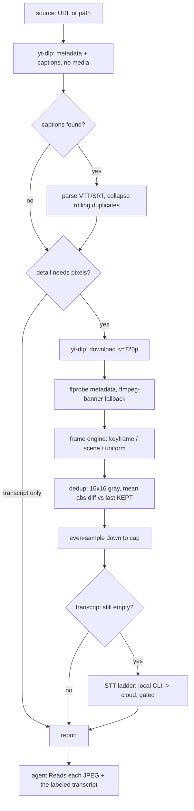

# Pipeline — how a run actually works

## Detail modes

| Mode | Engine | Cap | Notes |
|---|---|---|---|
| `transcript` | none | 0 | On a captioned URL, downloads **no media at all**. Cheapest by far. |
| `efficient` | `-skip_frame nokey` | 50 | Only reconstructs keyframes, so it is roughly 40× faster than scene detection, which must decode every frame. On low-motion footage it can return *more* frames than `balanced` — "efficient" means fast extraction, not fewer frames. |
| `balanced` | `select=gt(scene,0.20)` | 100 | Default. |
| `full` | `select=gt(scene,0.20)` | none | Every detected cut. Use on long videos where coverage matters more than tokens. |

**Fallbacks.** `efficient` falls back to uniform sampling below 4 keyframes;
the scene modes fall back below 2 candidates. Fewer than 2 scene candidates
means the filter found no cuts at all — a static screen recording or talking
head — where uniform sampling genuinely covers the content better. The report's
**Frames** line always names the engine actually used and whether it fell back,
so a uniform run never masquerades as scene-aware.

## Frame budget

Token cost is dominated by frames; the transcript is cheap. Budget by duration,
then let the engine fill up to the mode's cap, whichever is lower.

| Duration | Full-video target |
|---|---|
| ≤ 30 s | ~duration in seconds (min 12) |
| 30–60 s | 40 |
| 1–3 min | 60 |
| 3–10 min | 80 |
| > 10 min | the mode cap, sparsely — prints a sparse-scan warning |

Focused runs (`--start`/`--end`) get denser budgets because a named range means
the user is zooming in: ≤5 s → up to 10 frames, ≤15 s → 30, ≤30 s → 60,
≤60 s → 80, beyond → the cap. **Sampling never exceeds 2 fps**, in any mode.

## Token maths

Anthropic bills an image at roughly `(width × height) / 750`. At the default
512px width a 16:9 frame is 512×288 → **~197 tokens**. So:

- 50 frames (`efficient`) ≈ 10k image tokens
- 100 frames (`balanced`) ≈ 20k image tokens
- `--resolution 1024` quadruples it — only for reading on-screen text

On a long captioned video the **transcript** is often the larger cost: ~27k text
tokens for a 49-minute talk. `--detail transcript` avoids all image cost.

## Deduplication

A held slide or paused screen recording produces a dozen near-identical frames,
each billed separately. One ffmpeg call renders every extracted JPEG to a 16×16
grayscale thumbnail through the `concat` demuxer; the comparison is pure stdlib
(no image library). A frame whose mean per-pixel difference from the **last kept
frame** is ≤ 2.0 (on a 0–255 scale) is dropped.

**The concat demuxer needs `-fps_mode passthrough`** (`-vsync 0` on ffmpeg < 5.1;
`media.passthrough_flag()` probes and picks). A sequence of stills fed through
`concat` all carry effectively the same presentation timestamp, and ffmpeg's
default CFR sync silently **drops** the duplicates: a 12-frame pass emitted only
4 thumbnails, so dedup compared the wrong frames and collapsed nothing while
reporting a healthy `0 dropped`. If the thumbnail count ever mismatches the
frame count, `dedup()` now warns on stderr and keeps every frame rather than
failing quietly.

Comparing against the last *kept* frame rather than the immediately previous one
is what catches a slow fade: every step is under threshold, but the cumulative
drift is not. The threshold is deliberately low and measures absolute brightness
rather than structure, so a one-line code diff, a terminal scrolling one row, or
two differently-coloured flat slides all survive.

The cap is applied **after** dedup, so the budget is spent on distinct frames.
If thumbnailing fails for any reason, every frame is kept — the safe direction.

## Transcript ladder

1. **Native captions** (yt-dlp) or a `.vtt`/`.srt` sidecar beside a local file.
2. **Local Whisper CLI** — `faster-whisper` or `whisper`, only if already
   installed. Never installed automatically.
3. **Cloud Whisper** — Groq `whisper-large-v3` or OpenAI `whisper-1`. Requires
   **both** a key and `--allow-remote-transcription`. A key alone transmits
   nothing, because uploading someone's audio should be a deliberate act rather
   than a side effect of having configured an unrelated key.

Audio for STT is mono 16 kHz 64 kbps mp3, ~0.5 MB/min. The 24 MB guard sits
under both providers' 25 MB upload ceiling; longer audio errors with a pointer
to `--start`/`--end` rather than silently truncating.

### Rolling captions

YouTube auto-captions arrive as a scrolling window: each spoken line is
re-rendered two or three times as the caption box advances. Naive prefix
matching misses the transition cue that repeats the *tail* of the previous one,
so every line ends up duplicated. `_collapse_rolling()` compares whole lines
against the last line kept and collapses only exact matches — a genuine
repetition split across two different cues survives.

## Portability notes

These are the failure modes that break comparable tools in the wild; each is
handled in code, not documentation.

- **`-vsync` was removed in ffmpeg 9.** `media.vfr_flag()` runs a 50 ms lavfi
  probe once per process and emits `-fps_mode vfr` when supported, `-vsync vfr`
  otherwise. Never assume either — ffmpeg 8.1.2 still accepts `-vsync`, so a
  version check alone would be wrong too.
- **Windows console encoding.** Every `subprocess.run` pins
  `encoding="utf-8", errors="replace"` (ffmpeg echoes the source's own metadata
  on stderr, which is not ASCII), and `watch.py` reconfigures stdout/stderr to
  UTF-8 at import. The report itself uses ASCII arrows for good measure.
- **`ffprobe` blocked while `ffmpeg` runs.** An Application Control policy
  (WDAC / Smart App Control) can deny one binary and allow its sibling.
  `shutil.which()` answers "does this file exist", not "may I execute it", so
  the probe is behavioural and metadata falls back to parsing the `ffmpeg -i`
  banner. The report's **Video** line names which probe was used.
- **The Python interpreter is discovered, not named.** On Windows bare
  `python`/`python3` normally resolve to the Microsoft Store *app execution
  alias*, which exists on PATH and then exits **53 with no output** when spawned
  non-interactively. `index.ts` probes candidates by executing them and, on
  win32, also enumerates `%LOCALAPPDATA%\Python\*` and
  `%LOCALAPPDATA%\Programs\Python\*`. `INSO_WATCH_PYTHON` pins one explicitly.
- **Working directories.** Runs land in `<temp>/inso-watch/run-<ms>/` and the
  newest 5 are kept; `--cleanup` clears them. A user-supplied `--out-dir` is
  never pruned and never cleared beyond this run's own `frame_*.jpg`. Nothing
  in this skill asks the agent to `rm -rf` a path.
